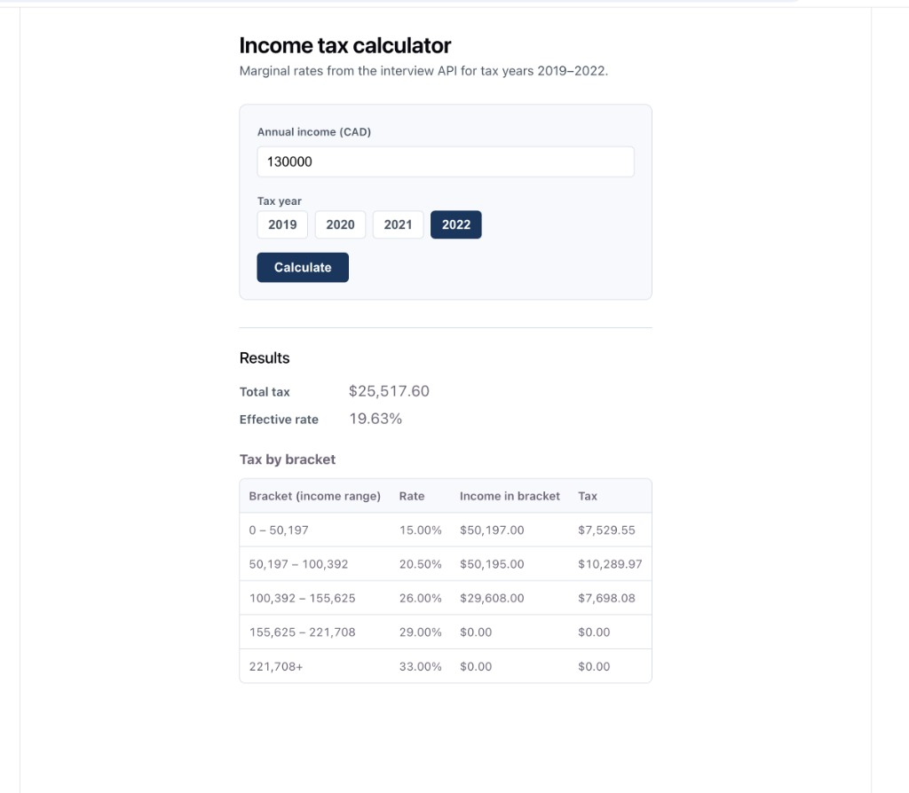

# Tax Calculator

Simple React app for calculating marginal income tax from API tax brackets.



## Stack

- React
- TypeScript
- Vite
- Vitest
- Playwright

## Run locally

Install dependencies:

```bash
npm install
```

Start the app:

```bash
npm run dev
```

The app uses `VITE_API_BASE_URL` and falls back to `http://localhost:5001` if it is not set.

## Scripts

```bash
npm run dev
npm run build
npm run lint
npm run test:run
npm run test:e2e
npm run lighthouse:run
npm run lighthouse:view
```

For Playwright UI mode:

```bash
npm run test:e2e:ui
```

## Tests

- Unit tests are written with `Vitest`
- E2E tests are written with `Playwright`
- Some Playwright tests mock the API response so they can run in CI without a backend

## CI

GitHub Actions runs:

- lint
- unit tests
- e2e tests
- Lighthouse accessibility audit

## Lighthouse

This project includes a Lighthouse check for accessibility. It runs against the production build in desktop mode.

To run it locally, build the app and start the preview server:

```bash
npm run build
npm run preview -- --host 127.0.0.1 --port 4173
```

Then, in a separate terminal, run:

```bash
npm run lighthouse:run
```

That generates `lighthouse-report.html` in the project root.

If you're on macOS, you can run the audit and open the report with:

```bash
npm run lighthouse:view
```

There is also a GitHub Actions workflow that builds the app, starts the preview server on `127.0.0.1:4173`, runs Lighthouse, and uploads the HTML report as an artifact.

